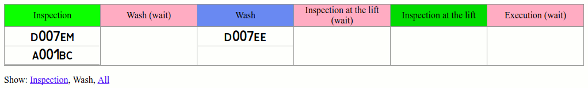

# pulltablo

The application displays in the form of a table the distribution of cars in the service center by the service stages (columns of the table).

Instead of a unoptimal architecture "get periodically the state of all cars and display" the architecture is used "partial display changes when the state of one car changes."

The application uses react, redux, reselect, reselect-map, nodejs, socket.io.

WebSocket is used: changes are pushed to the browser when they occur.

It is used React, reselect: only the changed elements of the page are resized.

If you change one car (the car from the "Washing" step has moved to the "Execution of work (waiting)"), only the columns "Wash" and "Execution of work (waiting)" will be redrawn.

